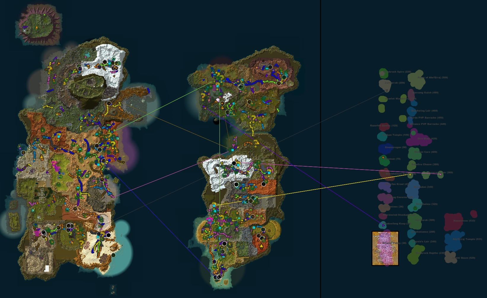
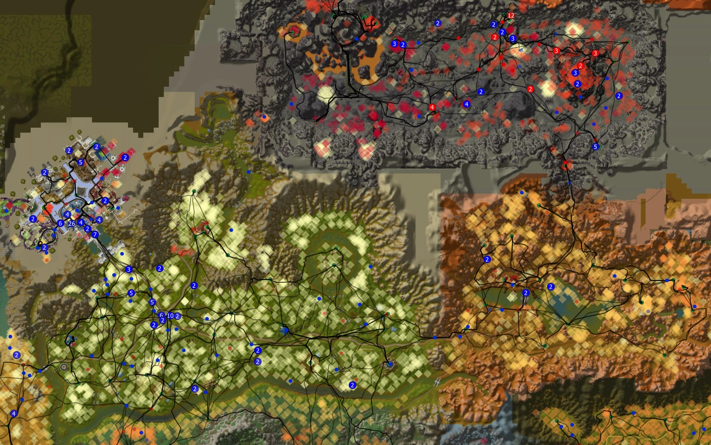
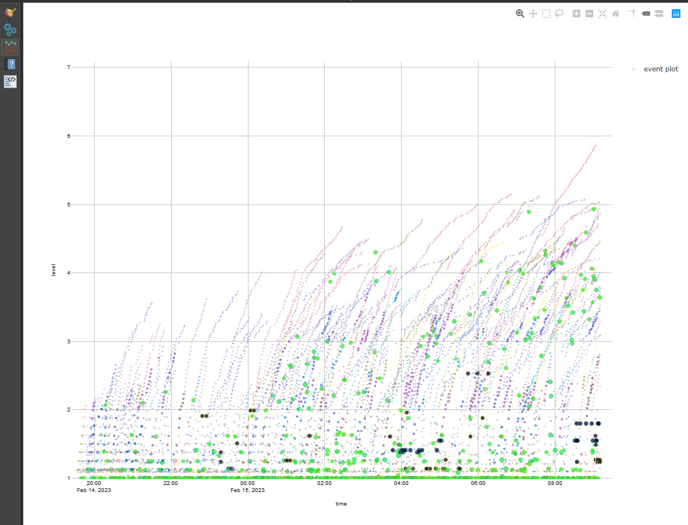
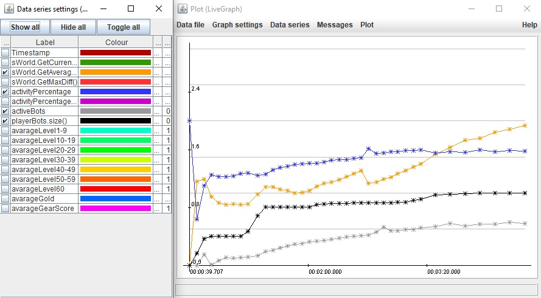

# SPP-MAP
 Qgis map for SPP repack
 
 

[What is this?]
This is a Qgis-map for the SPP-Vanilla repack (https://github.com/celguar/mangosbot-bots). It can be used to visualize a broad range of data exported from the server.

[How to use]
-Place the content in your Settings/[expansion]/Logs directory.
-Download and install QGIS https://www.qgis.org/nl/site/forusers/download.html
-Add plugin https://plugins.qgis.org/plugins/FreehandRasterGeoreferencer/
-[optional] Add plugin https://plugins.qgis.org/plugins/DataPlotly/
-[optional] Download https://sourceforge.net/projects/live-graph/
-When opening the qgz file keep any unavailable layers.
-Show and hide layers as wanted.

[How to see live data]
Add the following line to the bot config file:
AiPlayerbot.AllowedLogFiles =
Followed by the filenames (comma seperated) you want the server to generate. 
Examples included in the zip and more may be added or removed later.
Keep in mind some live log files can grow enormous in size. Use with care.

[How to see point information]
Select a layer (ie. player_simpel) and use the identify features function (ctrl+shift+i) and select one or multiple points.

[How to add a new map image]
The ADD button on the toolbar can be used to add any image to the map file. Keep in mind maps have to be manually scaled to match the data. Instances might be shifted between expansions so the maps might need to be shifted but not rescaled. See the freehand raster plugin for more information.

[How to see more/different data]
Read up on qgis or play with the examples. There are a lot of possibilities.

[Plot level progression]
-Needs bot_events.csv [make sure you add this to AllowedLogFiles]
-In qgis: Plugins -> dataplotty
-In dataplotty dock: configuration -> load configuration -> open bot_level_plot.xml
-Create plot

[Plot performance]
-Needs activity_pid.csv [make sure you add this to AllowedLogFiles]
-Open livegraph
-In lifegraph: Datafile -> open activity_pid.csv 
-Graph settings: open universal.lggs
-Data series: open universal.lgdss

[Have ideas, suggestions or need help?]
Contact mostlikely#6332 on discord or mosikely4r@gmail.com
